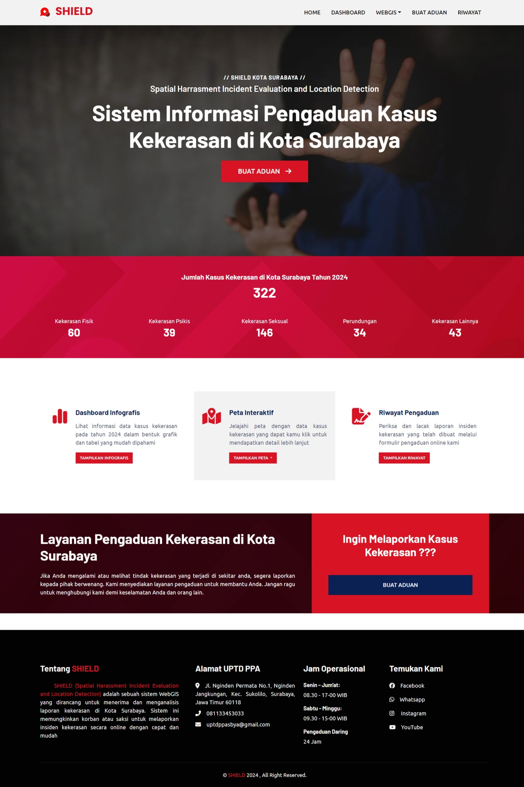
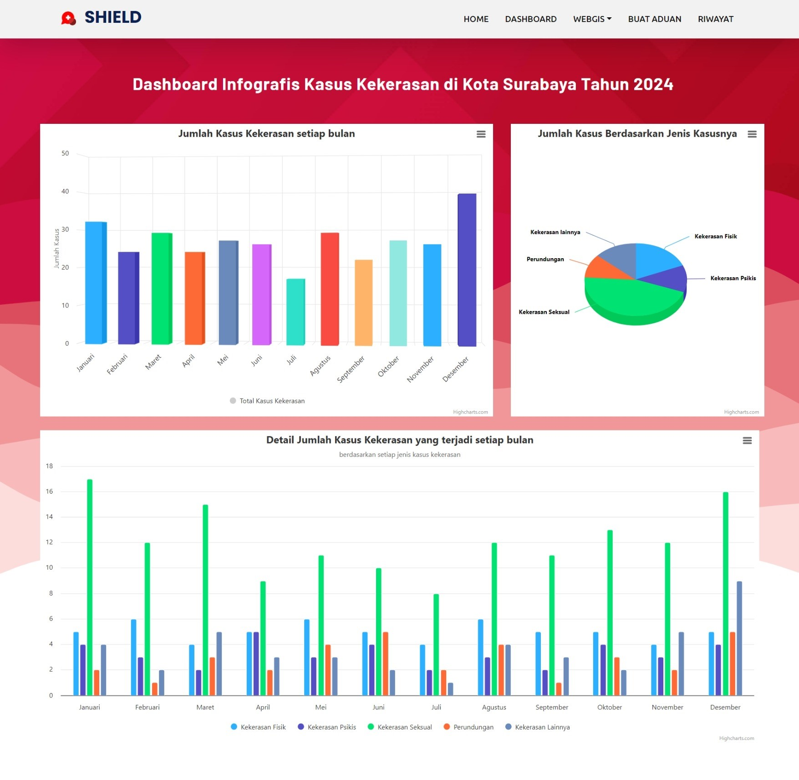
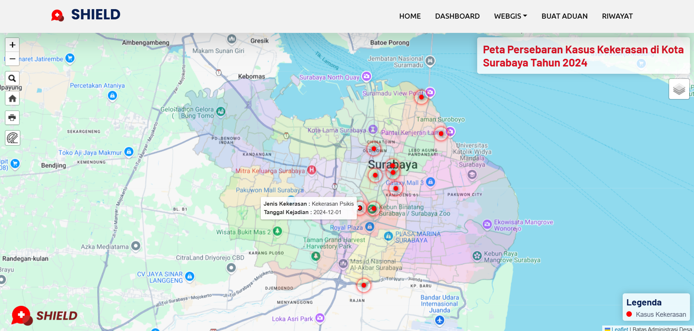
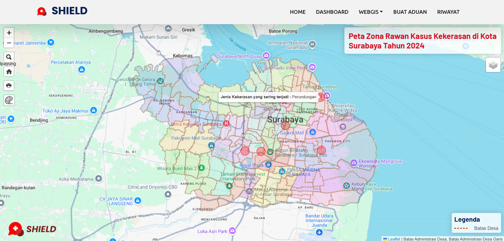
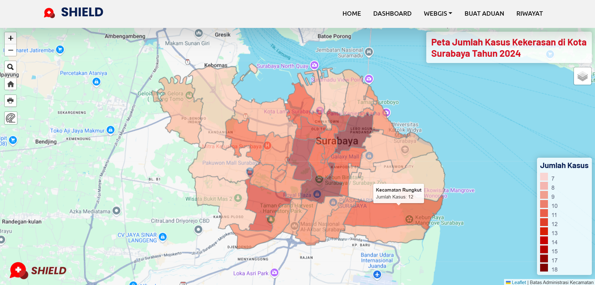
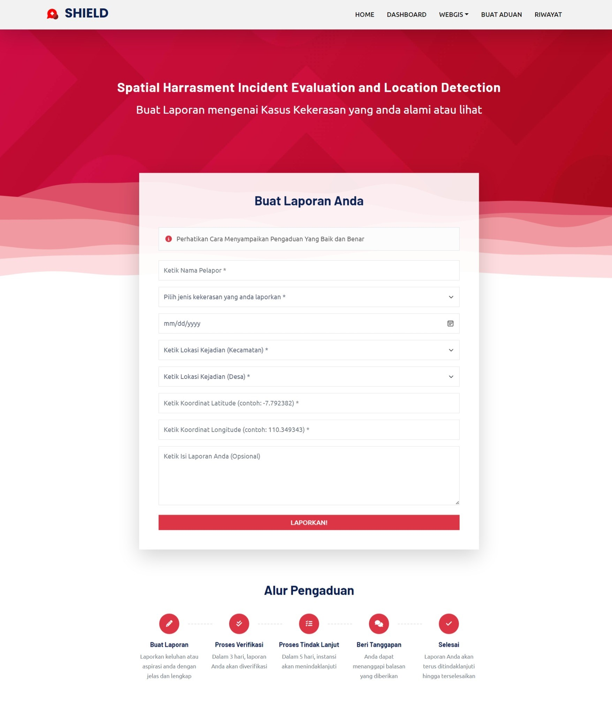
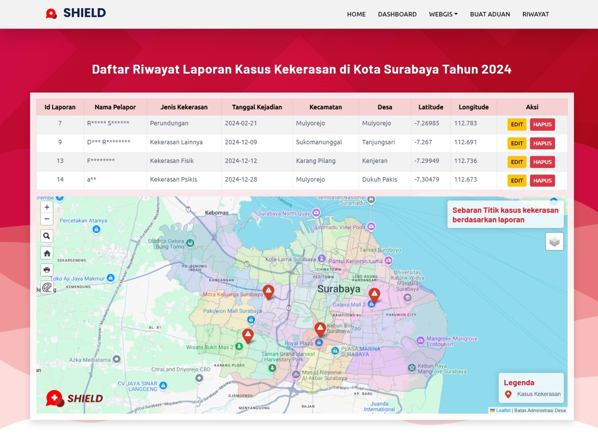

# SHIELD | Spatial Harrasment Incident Evaluation and Location Detection

## Apa itu SHIELD?

SHIELD (Spatial Harrasment Incident Evaluation and Location Detection) adalah sebuah sistem informasi geografis berbasis web yang dirancang khusus untuk Kota Surabaya. Sistem ini berfungsi sebagai platform pelaporan dan pemantauan kasus kekerasan. Melalui SHIELD, masyarakat dapat melaporkan kejadian kekerasan secara online dan langsung melihat visualisasi data kasus pada peta interaktif. Selain itu, SHIELD juga menyediakan berbagai infografis yang menyajikan data kasus secara lebih mendalam, sehingga dapat membantu dalam menganalisis tren dan pola kekerasan yang terjadi di kota. Dengan adanya SHIELD, diharapkan penanganan kasus kekerasan di Surabaya dapat menjadi lebih efektif dan efisien.

## Latar Belakang

Surabaya, sebagai kota metropolitan yang dinamis, sayangnya juga menjadi sorotan atas tingginya angka kasus kekerasan. Data tahun 2024 menunjukkan peningkatan signifikan dalam kasus kekerasan, terutama yang berkaitan dengan kekerasan dalam rumah tangga, pelecehan seksual, dan perundungan. Faktor-faktor seperti urbanisasi yang pesat, ketimpangan sosial, dan kurangnya akses terhadap pendidikan serta layanan kesehatan mental menjadi pemicu utama masalah ini. Dampak dari kekerasan tidak hanya bersifat fisik, tetapi juga memicu trauma psikologis yang berkepanjangan bagi korban. Upaya pencegahan yang telah dilakukan sebelumnya, seperti sosialisasi dan kampanye, perlu ditingkatkan dan diintegrasikan dengan upaya penanganan kasus yang lebih efektif. SHIELD diharapkan dapat menjadi solusi inovatif dalam mengatasi permasalahan ini dengan menyediakan platform pelaporan yang mudah diakses, analisis data yang komprehensif, serta visualisasi yang interaktif, sehingga dapat membantu mengidentifikasi pola kekerasan, merancang intervensi yang tepat, dan meningkatkan kesadaran masyarakat akan pentingnya menciptakan lingkungan yang aman dan inklusif.

## Teknologi yang Digunakan

### Bahasa
* **HTML :** Struktur dasar halaman web
* **CSS :** Gaya dan tampilan halaman web
* **JavaScript :** Interaktivitas dan manipulasi DOM
* **PHP :** Bahasa server-side untuk mengelola database dan logika aplikasi

### Library
* **Leaflet.js :** Pustaka JavaScript yang kuat untuk membuat peta interaktif.
* **Bootstrap :** Kerangka kerja front-end untuk membangun antarmuka web yang responsif dan mengutamakan seluler.
* **Highcharts.js :** Pustaka grafik untuk membuat grafik dan bagan yang interaktif dan menarik secara visual.
* **SweetAlert2 :** Perpustakaan modern untuk membuat peringatan dan pemberitahuan yang indah, responsif, dan dapat disesuaikan.
* **Moment.js :** Pustaka JavaScript untuk memanipulasi dan memformat tanggal dan waktu.

### Icons dan Font
* **Font Awesome** 
* **Ikon Bootstrap** 
* **Google Fonts API**

### Database 
* **Geoserver** 
* **MySQL** 

### Plugin Leaflet
* **Leaflet Icon Pulse** 
* **Pencarian Leaflet** 
* **Luas Default Leaflet** 
* **Leaflet Browser Print** 
* **Penggaris Leaflet** 

## Sumber Data 

* **Data Shapefile :** LapakGIS dan InaGeoportal
* **Data Gambar  :** Gambar dari Google, Gambar Background dari website LAPOR
* **Data Kasus Kekerasan :** Website Simfoni PPA dan beberapa dari Berita yang beredar

## Fitur SHIELD
- **Landing Page :** Halaman Awal yang menarik dan inovatif untuk menyambut pengguna.

- **Dashboard :** Infografis visualisasi data terkait data statistik kasus kekerasan.

- **WebGIS :** Peta interaktif untuk visualisasi data geografis dan analisis spasial terkait kasus kekerasan.

  
  
  

- **Buat Aduan :** Formulir online untuk melaporkan kejadian kasus kekerasan saat melihat atau mengalami.

- **Riwayat :** Informasi berupa tabel dan peta mengenai riwayat laporan yang dilaporkan pengguna melalui website.

